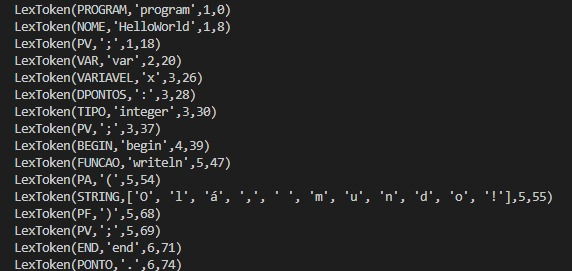
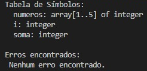
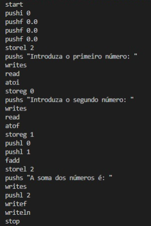

<div style="display: flex; height: 500px; border: 1px solid #ccc; font-family: sans-serif;">

  <div style="width: 100px; background-color:rgb(38, 108, 182);"></div>

  <div style="padding: 20px 40px; flex: 1; display: flex; flex-direction: column;">
    <div style="text-align: center; margin-right: 22px;">
      
    </div>
    <div style="margin-top: 20px;">
      <h1 style="margin: 0 0 30px 0; font-size: 2em;">Compilador para Pascal Standard</h1>
      <!-- Autores lado a lado -->
      <div style="display: flex; gap: 40px; margin-top: 20px;">
        <div>
          
          <p style="margin:0;font-size:0.7em;"><strong> Beatriz Salgado Fernandes</strong></p>
          <p style="margin:0;font-size:0.6em;">a100602</p>
        </div>
        <div>
          
          <p style="margin:0;font-size:0.7em;"><strong> João Silva Loureiro</strong></p>
          <p style="margin:0;font-size:0.6em;">a100832</p>
        </div>
      </div>
    </div>
    <div style="text-align:center; margin-top:80px">
        <p style="font-size:0.8em; margin-right:30px;">30 de Maio de 2025</p>
    </div>
  </div>
</div>


---

  <div style="padding: 40px;">
    <h2>Índice</h2>
    <ol>
      <li><a href="#introducao"> Introdução</a></li>
      <li><a href="#lexica"> Análise Léxica</a></li>
      <li><a href="#sintatica"> Análise Sintática</a></li>
      <li><a href="#semantica"> Análise Semântica</a></li>
      <li><a href="#codigo"> Geração de Código</a></li>
      <li><a href="#testes"> Testes</a></li>
      <li><a href="#conclusao"> Conclusão</a></li>
    </ol>
  </div>

---

<h2 id="introducao">1. Introdução</h2>

Foi nos propósta a  Construção de um Compilador para Pascal Standard, no âmbito da unidade curricular de Processamento de Linguagens. O objetivo do projeto é implementar um compilador funcional capaz de processar, analisar e interpretar programas escritos em Pascal, suportando as suas principais construções, tais como declarações de variáveis, expressões aritméticas, estruturas de controlo (como if, while e for), arrays e chamadas a funções. Este relatório documenta o desenvolvimento do mesmo.

O compilador foi construído de forma faseada, seguindo as principais etapas do processo de compilação: Análise Léxica, Análise Sintática, Análise Semântica, Geração de Código e por fim Teste. Foram utilizadas as ferramentas ply.lex e ply.yacc, que implementam os conceitos de análise léxica e sintática em Python, permitindo-nos trabalhar com tokens e regras gramaticais, de forma eficiente.

A abordagem seguida baseou-se na construção de uma Árvore de Sintaxe Abstrata (AST) durante a fase de parsing, o que nos permite representar a estrutura lógica do programa de forma clara e reutilizável para etapas seguintes, como a análise semântica e a eventual geração de código para a máquina virtual disponibilizada no projeto.

Ao longo do relatório, serão descritas as decisões de implementação, a estrutura da gramática adotada, os mecanismos de tratamento de operadores, a gestão de arrays, e a forma como o compilador foi preparado para produzir resultados corretos e testáveis, incluindo a escrita da AST para ficheiro e a execução de testes com programas Pascal reais.

---

<h2 id="lexica">2. Análise Léxica</h2>

Para conseguirmos então fazer o nosso compilador para Pascal, começamos por fazer o nosso Analisador Léxico.
Este recebe um ficheiro .pas, ou seja um programa em pascal, e converte-o numa lista de tokens, através do auxilio da ferramenta ply.lex.

Nesta fase, foi necessário identificar e distinguir corretamente os vários elementos da linguagem, como palavras-chave (program, begin, end), operadores (+, -, or, ...), identificadores, variaveis, entre outros.
A definição dos tokens foi feita utilizando expressões regulares que reconhecem estes padrões, independentemente do uso de maiúsculas ou minúsculas, já que Pascal não é case sensitive.

Começamos por garantir que os nomes de variáveis (VARIAVEL) fossem distinguidos de nomes de programa (NOME) com base na convenção do Pascal onde nomes de programas começam com letra maiúscula, enquanto variáveis e funções podem usar letras minúsculas ou underscore.

Decidimos separar os valores inteiros (INT) dos reais (REAL), já que em Pascal existe uma distinção clara entre os tipos Integer e Double. Essa separação facilita a análise semântica futura e garante que os tipos sejam tratados corretamente desde o início, visto que mais tarde na conversão de codigo as operações para inteiros são diferentes das para reais.

Os comentários do código são processados como tokens do tipo COMENTARIO, mas são ignorados pelo analisador. Isto porque os comentários não têm impacto na lógica do programa, sendo apenas úteis para o programador. No entanto, contabilizamos as quebras de linha dentro dos comentários para manter a numeração correta das linhas, essencial para mensagens de erro mais precisas.

Adicionalmente, apesar de numa fase inicial tratarmos as strings como simplesmente Strings (entre aspas simples), decidimos alterar a nossa abordagem para serem antes tratadas como uma lista de caracteres, visto que, em Pascal, as strings podem ser manipuladas como arrays de char. Esta escolha antecipa uma possível geração de código mais adequada a este tipo de estrutura.

No caso dos arrays, decidimos tratá-los de forma detalhada, separando cada componente em tokens distintos. Por exemplo, em vez de interpretar diretamente expressões como array[1..5] ou array['a'..'d'] como um único token ou intervalo, optámos por tokenizar separadamente cada elemento: ARRAY, RETOSABRIR ([), os valores (INT ou STRING), os pontos (.), e RETOSFECHAR (]).
Ao manter cada parte do array separada, a análise sintática fica mais precisa e modular. O parser pode então, verificar se os tipos nos limites são consistentes (inteiros ou caracteres), por exemplo.

Por fim, implementámos uma função de tratamento de erro (t_error) para lidar com símbolos inválidos. Isto permite detetar e relatar problemas léxicos de forma clara, sem interromper a análise do restante código.

<figure style="text-align: center; padding: 5px;">
  
  <figcaption style="font-size: 0.8em;"><em>Figura 1- Exemplo de um resultado do analisador léxico (Teste HelloWorld)</em></figcaption>
</figure>

---

<h2 id="sintatica">3. Análise Sintática</h2>

Após termos o Lexer feito, e os nossos tokens bem defenidos, passamos então para a definição da nossa gramática.
A nossa gramática é uma gramática Bottom-Up, com recursividade à esquerda e à direita.

```
S= programa

T = {PROGRAM, NOME, PV, PONTO, VAR, BEGIN, END, DPONTOS, TIPO, ARRAY, INT, RETOSABRIR, RETOSFECHAR, OF, VIRGULA, FUNCAO, PA, PF, ATRIBUICAO, IF, THEN, ELSE, FOR, TO, DOWNTO, DO, WHILE, ADD, SUB, MULT, DIVISAO, DIV, MOD, MAIOR, MENOR, IGUAL, DIFERENTE, MAIORIGUAL, MENORIGUAL, AND, OR, NOT, VARIAVEL, STRING, BOOLEAN, REAL}

N={ programa, bloco, declaracoes, declaracao, declaracao_array, listVar, comandos, comando, expressao}

P={
  p0: programa : PROGRAM NOME PV bloco PONTO
  p1: bloco : VAR declaracoes BEGIN comandos END
  p2:       | BEGIN comandos END
  p3: declaracoes : declaracoes declaracao
  p4:            | declaracao
  p5: declaracao : listVar DPONTOS TIPO PV
  p6:           | listVar DPONTOS ARRAY RETOSABRIR INT PONTO PONTO INT RETOSFECHAR OF TIPO PV
  p7:  listVar : VARIAVEL
  p8:          | listVar VIRGULA VARIAVEL
  p9:  comandos : comando
  p10:          | comando PV
  p11:          | comando PV comandos
  p12: comando : FUNCAO PA lista_parametros PF
  p13: comando : BEGIN comandos END
  p14: comando : VARIAVEL ATRIBUICAO expressao
  p15: comando : IF expressao THEN comando
  p16:         | IF expressao THEN comando ELSE comando
  p17: comando : FOR VARIAVEL ATRIBUICAO expressao direcao expressao DO comando
  p18: comando : WHILE expressao DO comando
  p19: comando : VARIAVEL RETOSABRIR expressao RETOSFECHAR ATRIBUICAO expressao  
  p20: direcao : TO
  p21:         | DOWNTO
  p22: lista_parametros : expressao
  p23:                  | lista_parametros VIRGULA expressao
  p24: expressao : NOT expressao
  p25:           | expressao ADD expressao
  p26:           | expressao SUB expressao
  p27:           | expressao MULT expressao
  p28:           | expressao DIVISAO expressao
  p29:           | expressao DIV expressao
  p30:           | expressao MOD expressao
  p31:           | expressao MAIOR expressao
  p32:           | expressao MENOR expressao
  p33:           | expressao IGUAL expressao
  p34:           | expressao DIFERENTE expressao
  p35:           | expressao MAIORIGUAL expressao
  p36:           | expressao MENORIGUAL expressao
  p37:           | expressao AND expressao
  p38:           | expressao OR expressao
  p39: expressao : FUNCAO PA VARIAVEL PF
  p40: expressao : VARIAVEL
  p41: expressao : INT
  p42: expressao : REAL
  p43: expressao : STRING
  p44: expressao : BOOLEAN
  p45: expressao : PA expressao PF
  p46: expressao : VARIAVEL RETOSABRIR expressao RETOSFECHAR
}
```

Utilizámos a ferramenta ply.yacc para implementar o Analisador Sintático. A ferramenta permite-nos definir regras de produção como funções Python, e associar a cada uma delas uma ação semântica — que no nosso caso, é a construção de um nó da Árvore de Sintaxe Abstrata (AST).

Esta decisão foi tomada para facilitar o processamento posterior do programa, permitindo representar de forma estruturada e hierárquica os componentes do código-fonte. Com a AST gerada diretamente durante a análise sintática, conseguimos simplificar etapas futuras como a análise semântica ou a geração de código.

Além das regras da gramática, foi também necessário definir a precedência dos operadores, para garantir que expressões como a + b * c são interpretadas corretamente. Definimos estas prioridades através da variável precedence, que segue a ordem habitual da aritmética e da lógica:
```
precedence = (
    ('left', 'ADD', 'SUB'),
    ('left', 'MULT', 'DIVISAO', 'DIV', 'MOD'),
    ('left', 'MAIOR', 'MENOR', 'IGUAL', 'DIFERENTE', 'MAIORIGUAL', 'MENORIGUAL'),
    ('right', 'ATRIBUICAO'),
    ('left', 'AND', 'OR'),
    ('right', 'NOT'),
    ('nonassoc', 'IFX'),
    ('nonassoc', 'ELSE'),
)
```
Como é possível observar, todas as nossas operações são feitas começando da esquerda para a direita, excepto nas atribuições e no NOT, uma vez que não podemos fazer nada sem ter primeiro um valor e nestes casos o valor aparece sempre à direita.

Outra decisão prática foi garantir que a árvore sintática final possa ser analisada ou utilizada noutra fase do projeto. Para isso, a AST é escrita, num ficheiro chamado AST, no final do processo de parsing. Isto permite-nos inspecionar visualmente a estrutura do programa e utilizar esse ficheiro como entrada para as próximas fases.

---

<h2 id="semantica">4. Análise Semântica</h2>

O analisador semântico é responsável por verificar se os elementos presentes no programa respeitam as regras semânticas da linguagem, complementando a análise sintática. Nesta fase, não se analisa apenas a forma do programa, mas também o seu conteúdo e coerência lógica. A implementação realizada trabalha com base na Árvore Sintática Abstrata (AST), previamente construída, e percorre essa árvore para detetar erros como uso de variáveis não declaradas, tipos incompatíveis em expressões e atribuições incorretas.

O processo começa com a construção da tabela de símbolos, onde são registadas todas as variáveis declaradas no programa, juntamente com os seus respetivos tipos. Caso uma variável seja declarada mais do que uma vez, é imediatamente gerado um erro. A tabela suporta também declarações de arrays, armazenando a informação sobre os limites e o tipo base dos elementos.

De seguida, procede-se à verificação do uso de variáveis. Esta etapa percorre toda a árvore sintática e identifica situações em que variáveis são utilizadas sem terem sido previamente declaradas.

Fazemos ainda a verificação de tipos. Para tal, é necessário inferir os tipos das expressões envolvidas em cada operação ou atribuição. A análise assegura que operadores aritméticos, como +, -, div e mod, são utilizados apenas com operandos do tipo inteiro ou real, e que operadores de comparação, como =, <, > ou <=, comparam operandos do mesmo tipo. Além disso, em atribuições, verifica-se se o tipo da expressão a ser atribuída é compatível com o tipo da variável de destino. Quando não existe compatibilidade de tipos, são reportados erros descritivos que indicam o tipo esperado e o tipo encontrado.

Por fim, o analisador imprime a tabela de símbolos gerada e uma lista de erros semânticos identificados, caso existam. A utilização de um conjunto (set) para armazenar os erros garante que mensagens repetidas não são mostradas múltiplas vezes. Esta implementação assegura uma verificação semântica robusta e eficaz, garantindo que o código analisado está logicamente consistente antes de avançar para a próxima etapa.

<div style="display: flex;">
  <figure style="text-align: center; padding: 5px;">
    
    <figcaption style="font-size: 0.7em;">Figura 2- Exemplo de um resultado do analisador semantico (Teste SomaArray)</figcaption>
  </figure>
  <figure style="text-align: center; padding: 5px;">
    
    <figcaption style="font-size: 0.7em;">Figura 3- Exemplo de um resultado do analisador semantico (Teste Fatorial)</figcaption>
  </figure>
</div>

---

<h2 id="codigo">5. Geração de Código</h2>

O Gerador de Código, que corresponde ao parser_cod, é responsável por transformar a árvore sintática abstrata construída durante a análise sintática, em código intermédio para a Virtual Machine. Este percorre a árovre toda de maneira a transformar cada nodo, no respetivo código máquina. Inicialmente, tal como no analisador semântico, uma tabela de símbolos é mantida como um dicionário, onde cada variável é associada a um índice na stack e ao seu tipo, estas, aquando da sua declaração na árvore, são inicializadas com um valor padrão conforme o seu tipo, isto é, pushi 0 para integer, pushs "" para string, e assim sucessivamente. 

Durante a geração de código, o gerador trata cada nodo da AST de forma específica, para poder assim dar as instruções. Falando de alguns desses tratamentos de nodos, quando o nodo corresponde a uma função embutida (como readln, writeln ou length), são emitidas instruções distintas conforme o comportamento pretendido:
No caso da função readln, o gerador emite a instrução read adequada ao tipo da variável (como readi para integer ou reads para string), e a seguir uma instrução storel para guardar o valor lido na posição da stack associada à variável.
Para writeln, os argumentos são processados individualmente e são geradas instruções writei, writes, ou outras, dependendo do tipo, seguidas de um writeln para imprimir a quebra de linha.
Quando se trata da função length, o gerador assume que o argumento é uma variável do tipo array e gera a instrução pushi com o comprimento do array (que pode ser conhecido estaticamente com base na análise prévia), de forma a simular o comportamento da função length.

Além disso, referindo quando temos operadores aritméticos e lógicos (como +, -, mod, div, and, =, etc.) estes são tratados com instruções diretas da máquina virtual, como add, sub, mod, equal, entre outras, sendo os elementos em questão avaliados recursivamente antes da emissão da operação correspondente.

O gerador de código trata ainda estruturas de controlo como if, while, ou for, utilizando rótulos únicos para implementar saltos condicionais (jz, jump, etc.), garantindo a correspondência correta entre blocos de código e as instruções de controlo de fluxo da máquina virtual.
  No caso de um "if", o gerador avalia a condição e cria dois rótulos: um para o corpo do then e outro para o fim da estrutura (endif). Dependendo da presença de um else, gera os blocos e os saltos correspondentes para garantir o fluxo de controlo adequado.
  Um "while" gera um rótulo de início e um de fim. A condição é avaliada, e se for falsa (jz), salta para o fim do ciclo; caso contrário, executa o corpo e salta de volta para o início.
  O ciclo "for" é decomposto em inicialização, condição e incremento, com a lógica adequada de rótulos para repetir enquanto a condição for verdadeira.

Relativamente aos arrays, a geração de código considera dois cenários principais: declaração e atribuição.
Na declaração de arrays, o tipo e os limites são analisados e reservam-se posições consecutivas na stack para armazenar os elementos. Arrays de integer usam pushn, enquanto arrays com elementos do tipo real e do tipo booleano inicializam posição a posição com pushf 0.0 ou pushi 0, respetivamente. A tabela de símbolos guarda informação sobre os limites e o índice base de cada array. Na atribuição dos mesmos, o valor é primeiro avaliado e empilhado, e depois é usada a instrução storeg para guardar esse valor na posição correta, com o índice global a ser atualizado (self.incrementador) a cada uso.

Por fim, o código gerado é encapsulado entre as instruções start e stop, sinalizando à máquina virtual o início e o fim da execução do programa. 

Na imagem abaixo conseguimos ver um exemplo da execução do parser_cod, para o teste Somador.pas
<figure style="text-align: center; padding: 5px;">
    
    <figcaption style="font-size: 0.7em;">Figura 4- Exemplo do código gerado (Teste Somador)</figcaption>
</figure>

---

<h2 id="testes">6. Testes</h2>

Após termos então o nosso compilador completo, dedicamos algum tempo aos testes. Para o testar, optamos por usar os exemplos de programas em Pascal fornecidos pelo professor no enunciado. 

Para além desses criamos alguns programas novos para testar outras funcionalidades que adicionamos e não tinha nos testes base, como o or, and, contas com reais e inteiros, >=, <=, entre outros.
Gostavamos também de mencionar que adicionamos um teste com varios tipos de comentarios em Pascal, apenas para ser possivel ver que eles são processados como tokens mas são ignorados, logo não dá pra usar este teste no parser.

Por último, adicionamos dois programas, em Pascal, errados (`ErroSemantico1.pas` e `ErroSemantico2.pas`), para testar o nosso analisador semantico. Ao correr esse teste e depois correr  *python3 ana_sema.py*, vai aparecer os erros de semantica dos programas.

Para correr os testes começamos por correr o comando:
```
python3 parser.py Testes/NomePrograma.pas
```
onde NomePrograma é o nome do programa que pretendemos testar. Este comando vai nos gerar então a AST e depois é apenas necessário correr o comando:
```
python3 parser_cod.py
```

Após isto, é impresso no terminal uma serie de comandos em linguagem assembly, que devem ser colocados na Virtual Machine, e depois corridos pra testar.

---

<h2 id="conclusao">7. Conclusão</h2>

Em suma, este projeto permitiu-nos desenvolver um compilador funcional para a linguagem Pascal Standard, implementando de forma faseada todas as etapas fundamentais do processo de compilação: análise léxica, análise sintática, análise semântica e geração de código. Ao longo do desenvolvimento, aplicámos conhecimentos teóricos e práticos sobre gramáticas formais, autómatos, tabelas de símbolos e estruturas de controlo, consolidando a nossa compreensão dos mecanismos internos de um compilador.
Numa fase inicial, construímos uma Árvore de Sintaxe Abstrata (AST) a partir da gramática definida, que serviu como base para as restantes fases do compilador. Com ela, validámos a coerência estrutural e semântica dos programas analisados, detetando situações como uso de variáveis não declaradas ou incompatibilidades de tipo. A geração de código foi feita de forma modular, traduzindo os nós da AST em instruções concretas da máquina virtual, capazes de representar operações aritméticas, lógicas, ciclos, condicionais, leitura/escrita, arrays e muito mais.
Embora nem todos os exemplos de teste tenham funcionado na totalidade, conseguimos garantir o tratamento correto de variáveis dos mais diversos tipos (inteiros, reais, booleanos e strings), bem como a sua manipulação em contextos variados. Adicionalmente, conseguimos suportar estruturas complexas como arrays com intervalos dinâmicos e expressões encadeadas, o que demonstra a robustez da gramática e da arquitetura do compilador.
Como possíveis melhorias futuras, destacamos a implementação de subprogramas (procedures e functions) e a introdução de otimizações no código gerado. A inclusão destas funcionalidades permitiria um suporte mais completo à linguagem Pascal e traria o compilador para um nível mais próximo de produção. 
Em conclusão, este trabalho foi fundamental para aprofundarmos os nossos conhecimentos na área dos compiladores, permitindo-nos aplicar conceitos teóricos em problemas concretos, com resultados práticos e observáveis. O compilador desenvolvido representa uma base sólida sobre a qual se pode continuar a construir, expandir e refinar.

---